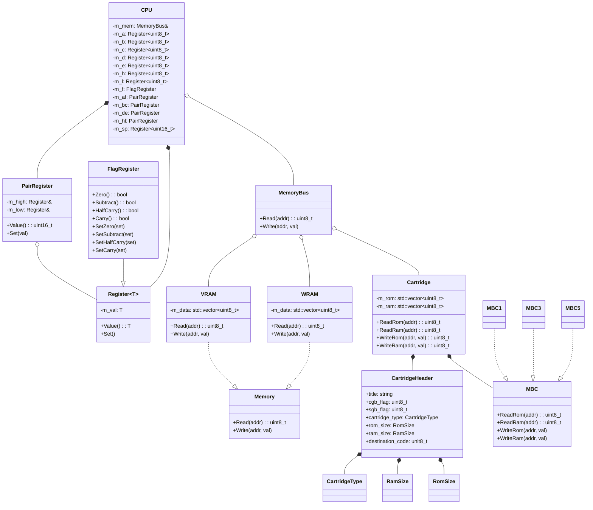

# Yeenboy
An in-development Gameboy emulator written in C++. Hopefully it's fast, I dunno.

## Compiling From Source
1. Clone the repository (recursively, so that submodules are cloned as well)
    ```shell
    git clone --recursive https://github.com/ShinraiYeen/Yeenboy.git
    ```

2. Install required dependencies.
    ```shell
    sudo apt install libsdl2-dev build-essential cmake
    ```

3. Build the project.
    ```shell
    cd Yeenboy
    mkdir -p build && cd build
    cmake ..
    make -j
    ```

4. (Optional) Run the unit tests to confirm everything is working properly.
    ```shell
    ctest
    ```

## Architecture Diagram
